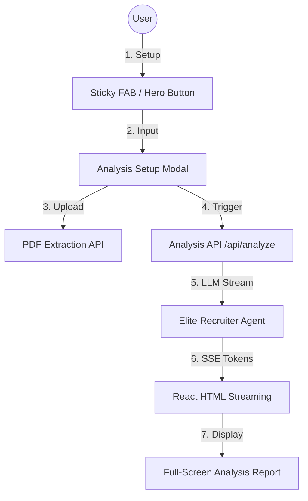

# Unified Application Workflows — Resume Intel

This document defines the end-to-end workflows of the Resume Intel application, covering the frontend user experience, the backend streaming architecture, and the AI-driven HTML generation.

---

## 1. High-Level Architecture Map



---

## 2. Structural UI Flow

### Workflow A — Initiating Analysis
1.  **Landing Page**: The user arrives at a clean, centered interface with a "Get Started" button.
2.  **Setup Modal**: Clicking "Get Started" (or the Sticky FAB) opens a glassmorphism modal.
3.  **Smart Upload**: Users drag-and-drop or select a PDF. The backend extracts text and populates the resume field automatically.
4.  **Submission**: User pastes the Job Description and clicks "Generate Smart Analysis".

### Workflow B — Full-Screen Viewing
1.  **Immersive Loading**: The modal closes, and a centered brain icon with radiating energy waves indicates the AI is processing.
2.  **Progressive Rendering**: The analysis results stream directly into a centered, full-width container.
3.  **Sticky Persistence**: Once results are visible, a sticky floating button (FAB) appears in the top-left to allow initiating a new search without clearing current results.

---

## 3. Backend Streaming & AI Interaction

### Workflow 1 — PDF Text Extraction
- **Endpoint**: `POST /api/extract-text`
- **Logic**: Receives a `multipart/form-data` PDF file.
- **Processing**: Uses `pypdf` to read and concatenate text from all pages.
- **Response**: Returns simple JSON `{"text": "..."}` for frontend population.

### Workflow 2 — HTML Analysis Streaming
- **Endpoint**: `POST /api/analyze`
- **Engine**: LangChain + Groq (Llama 3.3 70B).
- **Format**: Server-Sent Events (SSE).
- **Payload**: JSON chunks containing the `token` (HTML fragment).

---

## 4. AI Design Language (The Contract)

The AI generates a **standalone HTML fragment** using inline styles to ensure perfect rendering within the dark-themed host.

### Visual Design Tokens (Inline)
- **Background cards**: `#1a1e28` (Elevated surface)
- **Primary Text**: `#f8fafc` (Main content)
- **Muted Text**: `#94a3b8` (Labels/Context)
- **Status Colors**: 
    - **Positive (Found)**: `#10b981` (Green)
    - **Negative (Missing)**: `#ef4444` (Red)
    - **Neutral (Preferred)**: `#f59e0b` (Amber)
- **Theme Font**: `Outfit`, sans-serif.

### Mandatory Report Sections
1.  **Match Score**: Large circular display + horizontal progress bar + label (Strong/Partial/Weak).
2.  **Skills Analysis**: Pilled badges for required and preferred skills.
3.  **Strengths**: High-impact cards with checkmark icons.
4.  **Weaknesses**: Critical gap cards with "✗" icons.
5.  **Suggestions**: Prioritized improvement cards categorized by Keywords, Experience, Formatting, etc.

---

## 5. Frontend Streaming Workflow

### Step 1: SSE Initialization
React initializes a `fetch` request with a streaming reader. `setHtmlReport('')` and `setLoading(true)` are triggered.

### Step 2: Buffer Handling
Incoming bytes are decoded into UTF-8 strings. Chunks are split by `\n\n` to handle potential multiple SSE messages in a single packet.

### Step 3: Incremental State Update
Tokens are appended to the `htmlReport` state. React's `dangerouslySetInnerHTML` renders the cumulative fragment instantly.

```javascript
// App.jsx Logic
if (msg.token) {
  setHtmlReport(prev => prev + msg.token);
}
```

### Step 4: Finalization
When the `done` message is received (or stream ends), `loading` is set to `false`. The Sticky FAB becomes visible, allowing the user to initiate Workflow A again.

---

## 6. Technical Stack Reference

| Layer | Technology |
| :--- | :--- |
| **Frontend** | React (Vite), Outfit Font, CSS-in-CSS (index.css) |
| **Backend** | FastAPI (Python), Uvicorn, LangChain |
| **LLM** | Llama 3.3 70B via Groq |
| **Parsing** | pypdf |
| **Design** | Glassmorphism, BEM with custom utility tokens |
